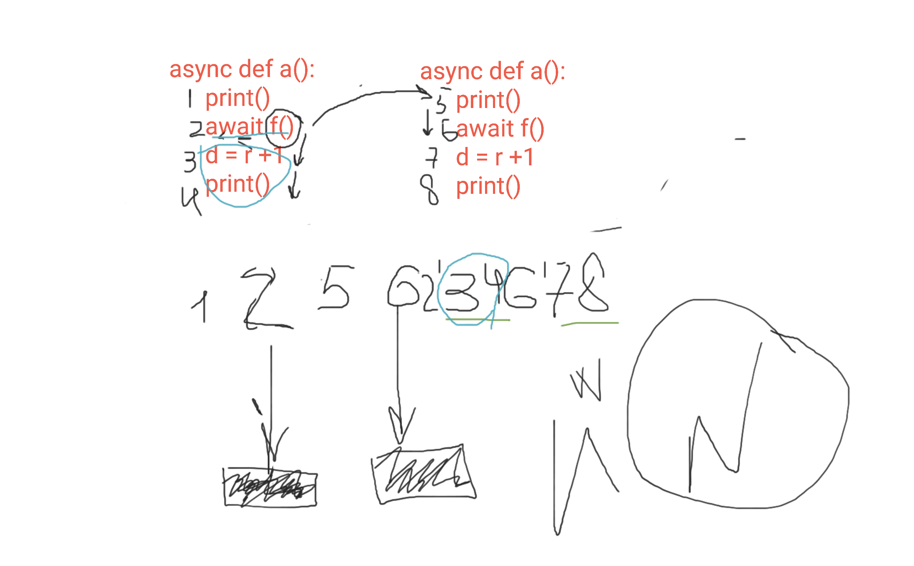

# async_lessons
lessons on asynchronous programming

## **Урок 1.**  

### **1.1. Принципы работы sync, await, async for, async with**
  
  
### **1.2. Виртуальное окружение**
`pip install poetry`
>Если требуется библиотека, то устанавливается `sudo apt install python3-poetry`  
`poetry init`  инициализация окружения в папке  
`poetry shell`  просмотр окружения  
> Например установим библиотеки aiogram и aiosqlite3 и tinkoff  
`pip install aiogram aiosqlite3 tinkoff` установка библиотек в базовое окружение  
`poetry add aiogram aiosqlite3 tinkoff` присоединение библиотек к приорити  
